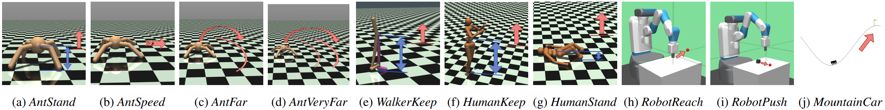
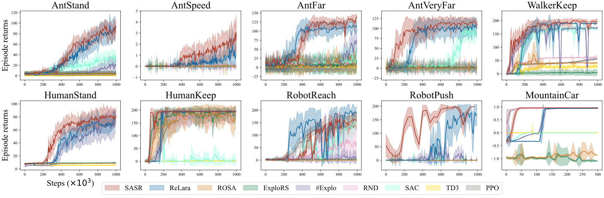

# COMP579 Project: SASR-PPO Reinforcement Learning Experiments

This repository contains the COMP579 project code for reinforcement learning experiments built around PPO, SASR, and SASR-shaped PPO. The project includes continuous-control experiments, custom environment wrappers, Super Mario Bros. experiments, evaluation scripts, plots, and the final report materials.

## Overview

The code compares several reinforcement learning agents:

- `PPO`: a Proximal Policy Optimization baseline for continuous-control and Mario tasks.
- `SASR`: a shaped-reward method that separates successful and failed trajectories.
- `SASR-PPO`: PPO augmented with SASR-style reward shaping for sparse-reward settings.
- `Duel DQN Mario`: a Dueling DQN baseline for the Mario environment.

The project targets sparse-reward exploration problems such as `MountainCarContinuous-v0` and `SuperMarioBros-1-1-v1`.

## Repository Structure

```text
.
|-- SASR/                    # Core PPO, SASR, SASR-PPO algorithms and networks
|-- RLEnvs/                  # Custom Fetch and MuJoCo environment wrappers
|-- run-PPO.py               # Train PPO on continuous-control environments
|-- run-SASR.py              # Train SASR on continuous-control environments
|-- run-PPO-mario.py         # Train PPO on Super Mario Bros.
|-- run-SASR-mario.py        # Train SASR on Super Mario Bros.
|-- run-SASR-PPO-mario.py    # Train SASR-shaped PPO on Super Mario Bros.
|-- run-dqn-mario.py         # Train Dueling DQN on Super Mario Bros.
|-- eval-PPO.py              # Evaluate continuous-control PPO checkpoints
|-- eval-SASR.py             # Evaluate continuous-control SASR checkpoints
|-- eval-PPO-mario.py        # Evaluate Mario PPO checkpoints
|-- eval-SASR-mario.py       # Evaluate Mario SASR checkpoints
|-- plots/                   # Generated experiment plots
|-- readme-images/           # Figures used by the report and README
|-- paper/                   # Report and paper assets
`-- requirements.txt         # Python dependencies
```

## Installation

Create and activate a Python environment, then install the dependencies:

```bash
pip install -r requirements.txt
```

For Mario experiments, the project uses `gym-super-mario-bros` and `nes-py`. If rendering is enabled, make sure your local environment supports display output.

## Training

Train PPO on a continuous-control task:

```bash
python run-PPO.py --env-id MountainCarContinuous-v0 --total-timesteps 2000000
```

Train SASR on a continuous-control task:

```bash
python run-SASR.py --env-id MountainCarContinuous-v0 --total-timesteps 2000000
```

Train PPO on Super Mario Bros.:

```bash
python run-PPO-mario.py --env-id SuperMarioBros-1-1-v1 --movement simple
```

Train SASR-shaped PPO on Super Mario Bros.:

```bash
python run-SASR-PPO-mario.py --env-id SuperMarioBros-1-1-v1 --movement simple
```

Training logs are written for TensorBoard, and checkpoints are saved under the experiment-specific output folders.

## Evaluation

Evaluate a trained continuous-control SASR checkpoint:

```bash
python eval-SASR.py --env-id MountainCarContinuous-v0 --model-dir ./SASR/ --exp-name sasr
```

Evaluate a trained Mario PPO checkpoint:

```bash
python eval-PPO-mario.py --model-dir ./ppo-mario/ --exp-name ppo-mario
```

Some trained checkpoint files are included in the repository so that selected experiments can be evaluated without retraining from scratch.

## Results

The `plots/`, `paper/`, and `readme-images/` directories contain the generated figures and report artifacts used to summarize the experiments.





## Notes

- CUDA can be selected with the `--cuda` flag in the training and evaluation scripts.
- Most scripts expose hyperparameters through command-line arguments; run a script with `--help` to inspect the full option list.
- Super Mario Bros. experiments use image preprocessing wrappers defined in `SASR/utils.py`.
